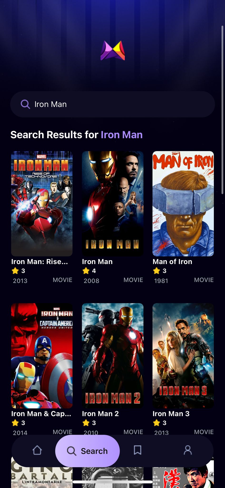

<h1 align="center"><samp>Movie APP</samp> </h1>

 
  
  
  

<h3><samp>Build with:</samp></h3>
<ul>
<li><samp>React Native</samp></li>
<li><samp>TypeScript</samp></li>
<li><samp>HTML5</samp></li>
<li><samp>Tailwind CSS</samp></li>
<li><samp>Appwrite</samp></li>  
<li><samp>themoviedb API</samp></li>
</ul>

<samp>
 <h2>App Features</h2>
<ul>
  <li>
    <strong>Homepage Display</strong>
    <ul>
      <li>View all available movies at a glance.</li>
      <li>Browse trending movies based on user search activity.</li>
    </ul>
  </li>
  <li>
    <strong>Movie Search</strong>
    <ul>
      <li>Search for movies by title using the dedicated search page.</li>
    </ul>
  </li>
  <li>
    <strong>Movie Detail View</strong>
    <ul>
      <li>Click on any movie to view its detailed information.</li>
      <li>Details include title, description, release year, and more.</li>
    </ul>
  </li>
  <li>
    <strong>Upcoming Features</strong>
    <ul>
      <li>Favorites: Save movies you love for quick access later.</li>
      <li>Profile: Personalize your experience with user settings and preferences.</li>
    </ul>
  </li>
</ul>
</samp>

<h2><samp>Live site</samp></h2>

Once visiting the Live Page please ensure to put on Mobile Mode: Right Click, Inspect, CTRL+SHIFT+M to enable device toolbar 

This APP is only for Mobile devices. 

<li><samp><a href="https://movieflix--200zop0ur5.expo.app">Live Page</a></samp></li>

<h2><samp>Screenshot</samp></h2>

   

